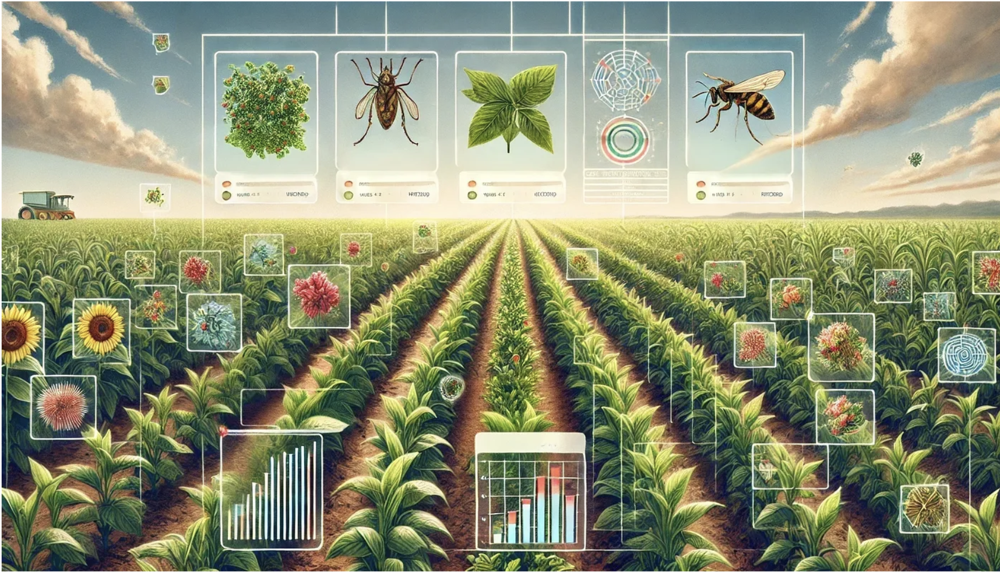
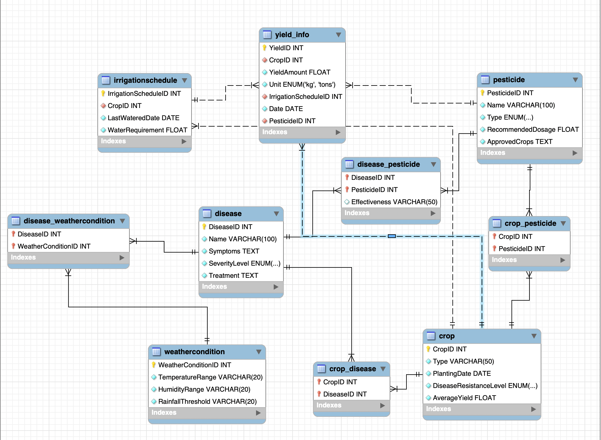

# 🌾 Crop Disease Management System


A **comprehensive database-driven system** for managing crop diseases, pesticides, irrigation schedules, and yield predictions. Designed to assist farmers, agronomists, and researchers in organizing critical agricultural data and providing a foundation for future predictive systems using machine learning.


---

## 📋 Table of Contents

- [🎯 Project Scope](#-project-scope)
- [✨ Features](#-features)
- [🗄️ Database Schema](#️-database-schema)
- [🚀 Installation](#-installation)
- [📊 Usage](#-usage)
- [🔧 Stored Procedures](#-stored-procedures)
- [📁 Repository Structure](#-repository-structure)
- [🤝 Contributors](#-contributors)
- [📈 Database Normalization](#-database-normalization)
- [🔮 Future Enhancements](#-future-enhancements)
- [📝 License](#-license)
- [🙋 Support & Extras](#-support--extras)

---

## 🎯 Project Scope

> ⚠️ **Note**: This project focuses on **relational database design and backend logic** only. Machine learning, real-time sensor integration, and API development are part of future plans.

### ✅ What this project includes:
- Structured MySQL database schema
- Stored procedures for data retrieval and basic alerts
- Sample data for quick testing
- ER diagram, documentation, and usage guide

### ❌ What this project does NOT include:
- Machine learning models for disease or yield prediction
- Real-time IoT sensor data integration
- Frontend or mobile interface

---

## ✨ Features

- 🌱 **Crop Management**: Track crop types, planting dates, resistance level, and expected yields  
- 🦠 **Disease Monitoring**: Database of diseases with symptoms, severity, and treatment  
- 💧 **Irrigation Scheduling**: Manage watering schedules and optimize water usage  
- 🧪 **Pesticide Management**: Disease-specific pesticide tracking and recommendations  
- ☁️ **Weather Integration**: Store temperature, humidity, rainfall for disease alert logic  
- 📊 **Yield Data Management**: Maintain historical crop yields and structure for ML integration  

---

## 🗄️ Database Schema

### 📌 ER Diagram



### 🔑 Entity Tables

| Entity | Attributes |
|--------|------------|
| **Crop** | `CropID`, `Type`, `PlantingDate`, `DiseaseResistanceLevel`, `AverageYield` |
| **Disease** | `DiseaseID`, `Name`, `Symptoms`, `SeverityLevel`, `Treatment` |
| **Pesticide** | `PesticideID`, `Name`, `Type`, `RecommendedDosage`, `ApprovedCrops` |
| **IrrigationSchedule** | `ScheduleID`, `CropID`, `LastWateredDate`, `WaterRequirement`, `WaterFrequency` |
| **WeatherConditions** | `WeatherID`, `Date`, `Temperature`, `Rainfall`, `Humidity` |
| **CropYield** | `YieldID`, `YieldAmount`, `IrrigationScheduleID`, `Date` |

---

## 🚀 Installation

### 🧰 Prerequisites

- MySQL Server (v8.0+)
- MySQL Workbench (optional for GUI-based management)

### 🛠️ Setup Instructions

```bash
# Clone the repository
git clone https://github.com/Puneeth0106/crop-disease-management-system.git
cd crop-disease-management-system

# Import the database schema
mysql -u root -p < database/schema.sql

# (Optional) Insert sample data
mysql -u root -p < database/sample_data.sql
````

---

## 📊 Usage

### ➕ Add New Crop

```sql
INSERT INTO Crop (Type, PlantingDate, DiseaseResistanceLevel, AverageYield)
VALUES ('Wheat', '2024-03-15', 'High', 2500);
```

### ⚠️ Disease Alert Based on Weather

```sql
CALL GetDiseaseAlert('Wheat', 25, 80, 150);
```

### 💊 Pesticide Recommendation by Disease

```sql
CALL RecommendPesticide('Blight');
```

---

## 🔧 Stored Procedures

| Procedure            | Description                                          | Logic Used            |
| -------------------- | ---------------------------------------------------- | --------------------- |
| `GetDiseaseAlert`    | Suggests possible diseases based on crop and weather | Threshold-based logic |
| `PredictYield`       | Returns estimated yield using basic multipliers      | Rule-based            |
| `RecommendPesticide` | Lists pesticide recommendations for a disease        | Table lookup          |

---

## 📁 Repository Structure

```pgsql
crop-disease-management-system/
├── README.md
├── LICENSE
├── database/
│   ├── schema.sql
│   ├── sample_data.sql
│   └── stored_procedures.sql
├── documentation/
│   ├── ER_Diagram.png
│   ├── presentation.pdf
│   └── design_document.md
└── images/
    ├── banner.png
    └── er_diagram.png
```

---

## 🤝 Contributors

* **Dinesh Kumar Raju Kattunga** — Database Design & Implementation
* **Puneeth Kumar Amudala** — System Architecture & Documentation

---

## 📈 Database Normalization

| Normal Form | Description                                                      |
| ----------- | ---------------------------------------------------------------- |
| **1NF**     | All attributes contain only atomic values                        |
| **2NF**     | Every non-prime attribute fully depends on the whole primary key |
| **3NF**     | No transitive dependency on non-prime attributes                 |

---

## 🔮 Future Enhancements

| Enhancement Area          | Description                                         |
| ------------------------- | --------------------------------------------------- |
| ✅ Machine Learning Models | Implement predictive disease and yield models       |
| ✅ IoT Sensor Integration  | Integrate real-time soil, weather, and crop sensors |
| ✅ REST API                | Enable third-party and frontend app access          |
| ✅ Mobile Application      | Develop a farmer-friendly app for input and alerts  |
| ✅ Multilingual Support    | Add support for regional languages                  |
| ✅ Role-Based Access       | Secure access for researchers, farmers, and admins  |

---


## 🙋 Support & Extras

Let me know if you’d like help with:

* 🏷️ **GitHub badges** (e.g., MySQL | MIT License | Contributions Welcome)
* 🧩 **A visual flowchart** showing system logic
* 📄 **One-page PDF summary** for presentation or academic submission

I'm happy to help you finalize everything! 🚀

📬 For questions, connect via [GitHub](https://github.com/Puneeth0106)

```

```
